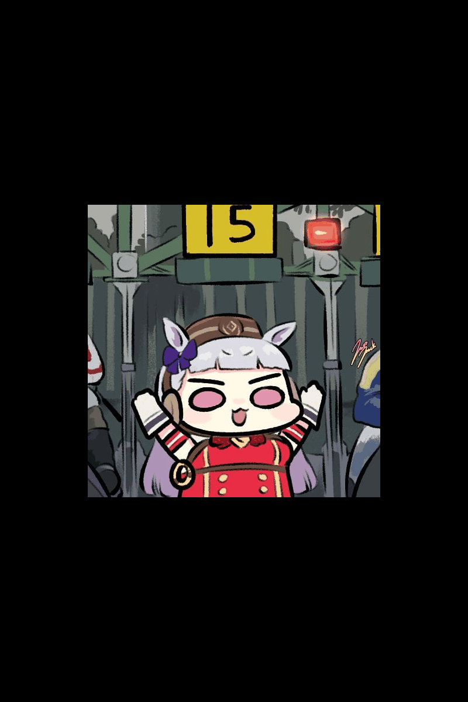

   
  <!-- Optional welcome GIF (uncomment & replace path) -->
  
  

## 🚀 Careers
<strong>
•&nbsp;WeAI&nbsp;(2024.02&nbsp;~) 
•&nbsp;충북대학교&nbsp;컴퓨터공학과&nbsp;(2023.03&nbsp;~)
</strong>

## 🛠️ Tech Stacks

  <code> Python</code>
  <code> MySQL</code>
  <code> Label&nbsp;Studio</code>

## 🧑‍💻 Contact

  

## 🏅 Stats

  
  

  

